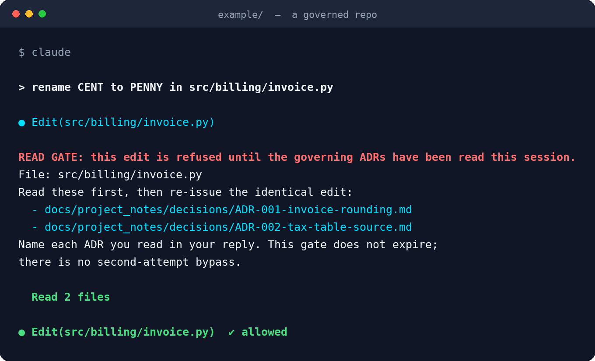

<div align="center">


[](https://github.com/PyGuy2000/k-mem/actions/workflows/ci.yml)
[](https://github.com/PyGuy2000/k-mem/releases)
[](LICENSE)
[](pyproject.toml)

[](https://code.claude.com/docs/en/plugins)
[](tests)
[](plugins/k-mem/lib/kmem)

**[Install](#install)** · **[What you get](#what-you-get)** · **[First session](#the-first-session)** · **[Your own repo](#your-own-repo)** · **[Design notes](docs/design.md)**

</div>

---

## Install

Memory and governance for Claude Code sessions, packaged as a plugin. It installs in two commands and works in any repo that keeps its decisions in markdown.

```
claude plugin marketplace add PyGuy2000/k-mem
claude plugin install k-mem@k-mem
```

That also installs [DevFlow](https://github.com/PyGuy2000/devflow-mcp), the ticket tracker the skills use. Both need `python3` on PATH (3.9 or newer) and `git`. DevFlow also needs the `mcp` package: `python3 -m pip install mcp`.

<div align="center">



*The refusal text is the hook's own output, captured from a run against `example/`.*

</div>

---

## What problem this solves

A coding session with Claude has three limits. Each fails at a different moment, so each gets a different fix.

1. **No memory across sessions.** Every session starts empty. Fix: the durable record lives in files, and hooks deliver those files at session start and prompt for them at session end.
2. **Rules that depend on attention degrade.** A rule delivered at turn 1 is unreliable by turn 400. Fix: each rule moves into a hook that fires at the moment of violation and refuses the action.
3. **A fact never learned cannot be missed.** The model confirms what it suspects and cannot see a gap. Fix: a generated list of everything that exists, delivered every session, so "there is no such thing" can be contradicted by a list.

A fourth rule follows from the first three: the record is not the check. A decision written in prose and never verified against the tree is a note to self. So the docs checks fail the build when the record and the tree disagree.

---

## What you get

**A read-before-write gate.** `.claude/adr_map.json` maps paths to the decisions that govern them. A write under a governed path is refused until the session transcript shows those decision files were read. Reading them and re-issuing the identical edit is the only way through. The gate sees the direct write tools, the MCP filesystem tools, and Bash commands that write (`sed -i`, redirects, heredocs, `cp`, `mv`, `tee`, `git checkout`, inline Python). A sweep after every Bash command logs any governed file that changed with no read record, so what the parser cannot see still gets counted. Every decision writes one evidence line to a JSONL file the model cannot edit.

**A context resolver.** For any path, the decisions that must be read, plus the records one explicit relation away: a contract that names the file, a plan row that covers the decision, a fact document that describes the directory. It reports collisions (a superseded decision still on the map, a parked plan) and a receipt hash. It compiles a disposable SQLite index from files the repo already keeps. Nothing in it is authored; delete the index and rebuild it and the answers do not change.

**Tiered project notes.** `STATE.md` is the current-state brief under a token budget, the one mandatory read. `plans.md` is one row per plan. `decisions/` holds one file per decision, indexed by a generated `decisions.md`. `key_facts.md`, `bugs.md`, `issues.md` are on demand. `kmem init` scaffolds all of it plus a block in `CLAUDE.md`.

**Handoffs between sessions.** A mailbox outside every repo. A note addressed to a project loads automatically when a session opens there. A session-end guard fires once when a long session leaves changes behind with no note queued.

**Docs checks.** Four checks that fail: a decision cited with no file, a stale decisions index, a `STATE.md` over budget, a decision that cites a decision that does not exist. Each has a proof of red in the tests: a fixture where the violation is present and the check must fail.

**A knowledge inventory.** Every knowledge file, every decision title, every handoff note across every configured repo, generated at session start from the files themselves.

**DevFlow.** Tickets with a mandatory reason, dependencies, a verification gate that refuses `done` until the ticket's check passes on the current commit, and a status report at session start.

---

## The first session

The repo ships an example. Open it and try the tools before touching your own repo.

```
cd example
kmem resolve --target src/billing/invoice.py
kmem resolve --target src/billing/tax.py
kmem audit
```

`invoice.py` is governed by two decisions; the fact document and a plan row ride along as advisory records. `tax.py` is governed by a decision that was superseded and is still on the map, which the resolver reports as a collision, on purpose. `kmem audit` passes all four checks.

To see the gate refuse an edit, ask Claude to change `src/billing/invoice.py` in a session opened in `example/`. The edit is refused with the two decision files named. Read them, ask again, and it goes through. Then ask for the same change through `sed -i`: refused again, with `via: bash` in the evidence.

---

## Your own repo

```
cd your-repo
kmem init
```

That writes the seven notes files, `.claude/adr_map.json`, and the `CLAUDE.md` block, and never overwrites a file that exists. Then:

1. Fill in `docs/project_notes/STATE.md`: what the project is, and the "Where to look" table.
2. Write the first decision: `kmem notes adr "Title"`. It creates the next numbered file and refreshes the index.
3. Put the decision's number into `.claude/adr_map.json` for the paths it governs.
4. Run `kmem audit`. It passes when every citation resolves, the index is fresh, and `STATE.md` is under budget.
5. Optional: `kmem install-git-hooks` adds a pre-commit hook that refuses a notes line naming future work with no ticket id on it.

Decisions can also live as `## ADR-NNN` headings inside one `decisions.md`. The gate and the resolver read both layouts.

---

## Configuration

One file: `~/.claude/plugins/data/k-mem-k-mem/config.json` (the plugin's data directory, named `<plugin>-<marketplace>` by Claude Code; `KMEM_DATA_DIR` overrides it). `kmem init` creates it. `kmem doctor` prints where everything is.

```json
{
  "repos": {"my_app": "~/code/my_app", "other_app": "~/code/other_app"},
  "aliases": {"app": "my_app", "other": "other_app"},
  "evidence_dir": "${CLAUDE_PLUGIN_DATA}/evidence",
  "index_dir": "${CLAUDE_PLUGIN_DATA}/context-index",
  "handoffs_dir": "${CLAUDE_PLUGIN_DATA}/handoffs",
  "devflow_state": "~/.config/devflow-mcp/devflow_state.json",
  "enforce": false,
  "state_budget_tokens": 15000,
  "session_start": {"stale_guard": true, "inbox": true, "packet": true, "inventory": true}
}
```

`repos` lists every checkout the resolver and the inventory may read. `aliases` maps a short qualifier to a repo, so `other ADR-012` in a decision resolves to that repo's decision 12. Every repo restarts numbering at 001, so a bare number always means the current repo.

`enforce` switches the gate from shadow to enforce mode. In shadow mode the map decides and the resolver runs beside it, logging whether the two agree. In enforce mode the resolver's set is added to the map's (it can add a required decision, never remove one) and the refusal carries the context packet and a receipt. A resolver failure in enforce mode logs a fallback line and the map decides; the gate never opens because the resolver broke.

To turn the gate off, create a file named `DISABLED` in the evidence directory. Every allow is then logged as `disabled`.

---

## Commands

| Command | What it does |
|---|---|
| `kmem init` | config file; in a repo, the notes scaffold, the map and the `CLAUDE.md` block |
| `kmem doctor` | where everything is, what is missing, what is not writable |
| `kmem resolve --target PATH` | the context packet for a path (`--json` for the full record) |
| `kmem index`, `kmem status`, `kmem edges` | rebuild the index, show its revisions, list edges that resolve to nothing |
| `kmem audit` | the four docs checks; exit 1 on a failure |
| `kmem report` | the gate evidence: matches, bypasses, unevidenced changes, by repo |
| `kmem inventory` | the knowledge inventory across every configured repo |
| `kmem notes index`, `kmem notes adr "Title"`, `kmem notes archive` | regenerate the index, create the next decision, move old bug and work-log sections to `archive/` |
| `kmem docs check`, `kmem docs stamp FILE` | fact documents whose source changed since they were synced; mark one synced |
| `kmem handoff inbox`, `kmem handoff send --to NAME --subject S` | the notes waiting for this project; queue one for another |
| `kmem install-git-hooks` | the pre-commit intent guard |
| `kmem hook NAME` | run one hook with a payload on stdin, for testing |

Skills the plugin adds: `/k-mem:project-memory`, `/k-mem:handoff`, `/k-mem:update-project-docs`, `/k-mem:adr`, `/k-mem:quick`. Commands: `/k-mem:idea` (collision check before planning), `/k-mem:park` (record a deferral with an unpark condition), `/k-mem:portfolio` (ticket brief), `/k-mem:on-track` (goal gauge).

---

## Limits, stated

The gate proves a read happened, not that it was understood. It fails open when the transcript is unreadable or the map is broken, and logs why, so a fault in the plugin never blocks all editing.

Only rules with a hook or a check are fenced. A rule that lives in `CLAUDE.md` prose still degrades with session length. The mitigation that works is shorter sessions with a handoff between them.

The inventory says a decision exists. Reading it is a separate step. Ticket work logs are not enumerated; search them in DevFlow.

The hooks run `python3` from PATH. On Windows that name may not exist; `kmem doctor` reports it.

A hook is only as good as the command that wires it. The tests run every hook through its launcher with the real payload shape, and the proof-of-red tests assert the refusal, because a wiring fault once turned every deny into an allow while the log kept saying "denied".

---

## How this compares

Most agent memory systems push memory into context at session start and hope it changed behavior, or wait to be asked for it. Few test whether the injected memory did anything. Almost none stop a write, a commit, or a build. K-mem does both directions: it pushes the brief and the inventory at session start, and it pulls at write time, commit time and reply time with a check that can refuse. The generated inventory is the other uncommon piece: a list that can prove a fact is absent.

---

## Development

```
python3 -m pytest
python3 scripts/release_check.py
```

The suite runs every hook as a subprocess through its launcher. The release check fails on any private name, host, path or ticket id in the tree; CI runs it with gitleaks. `docs/design.md` records the design and the reasons.

---

## License

MIT.
